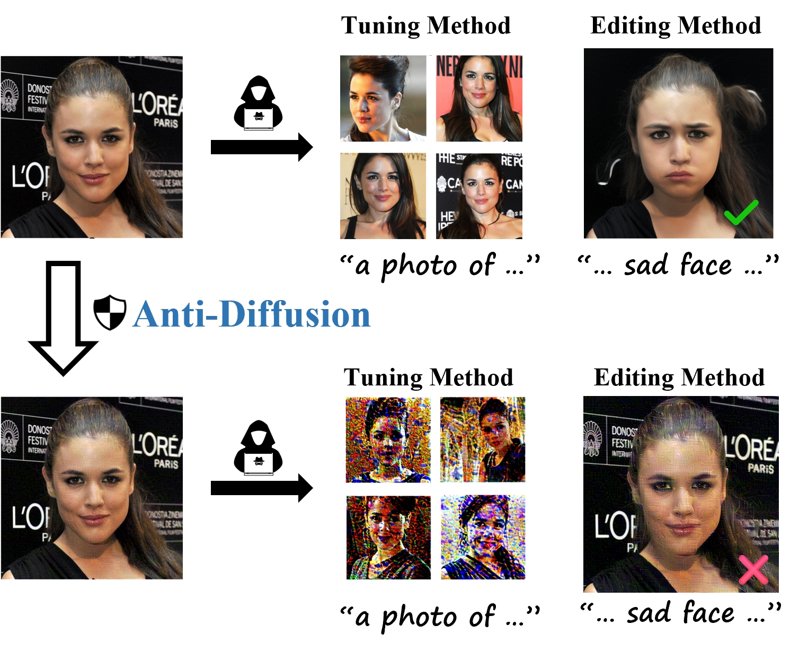

# Official PyTorch implementation of "Anti-Diffusion: Preventing Abuse of Modifications of Diffusion-Based Models" (AAAI'25)

<div align="center">
    
</div>

> **Abstract**: Although diffusion-based techniques have shown remarkable success in image generation and editing tasks, their abuse can lead to severe negative social impacts.
Recently, some works have been proposed to provide defense against the abuse of diffusion-based methods.
However, their protection may be limited in specific scenarios  by manually defined prompts or the stable diffusion (SD) version.
Furthermore, these methods solely focus on tuning methods overlooking editing methods that could also pose a significant threat. 
In this work, we propose Anti-Diffusion, a privacy protection system designed for general diffusion-based methods, applicable to both tuning and editing techniques.
To mitigate the limitations of manually defined prompts on defense performance, we introduce the prompt tuning (PT) strategy that enables precise expression of original images. 
To provide defense against both tuning and editing methods, we propose the semantic disturbance loss (SDL) to disrupt the semantic information of protected images.
Given the limited research on the defense against editing methods, we develop a dataset named Defense-Edit to assess the defense performance of various methods.
Experiments demonstrate that our Anti-Diffusion achieves superior defense performance across a wide range of diffusion-based techniques in different scenarios.

## Todo

- [x] Release core code of Anti-Diffusion (at dir Defense)
- [x] Release preview version of Defense-Edit (at dir Datasets/Defense-Edit)
- [ ] Full demo with tuning and editing methods 
- [ ] ...

## Environment setup

Install dependencies:
```shell
cd Anti-Diffusion
conda create -n anti-diffusion python=3.9
conda activate anti-diffusion
pip install -r requirements.txt
```

 ## How to run


To defense Stable Diffusion version 2.1 (default) with Anti-Diffusion, you can run
```bash
sh Scripts/anti-diffusion_demo.sh
```

## Contacts
If you have any problems, please open an issue in this repository or send an email to [umlizheng@gmail.com](mailto:umlizheng@gmail.com).